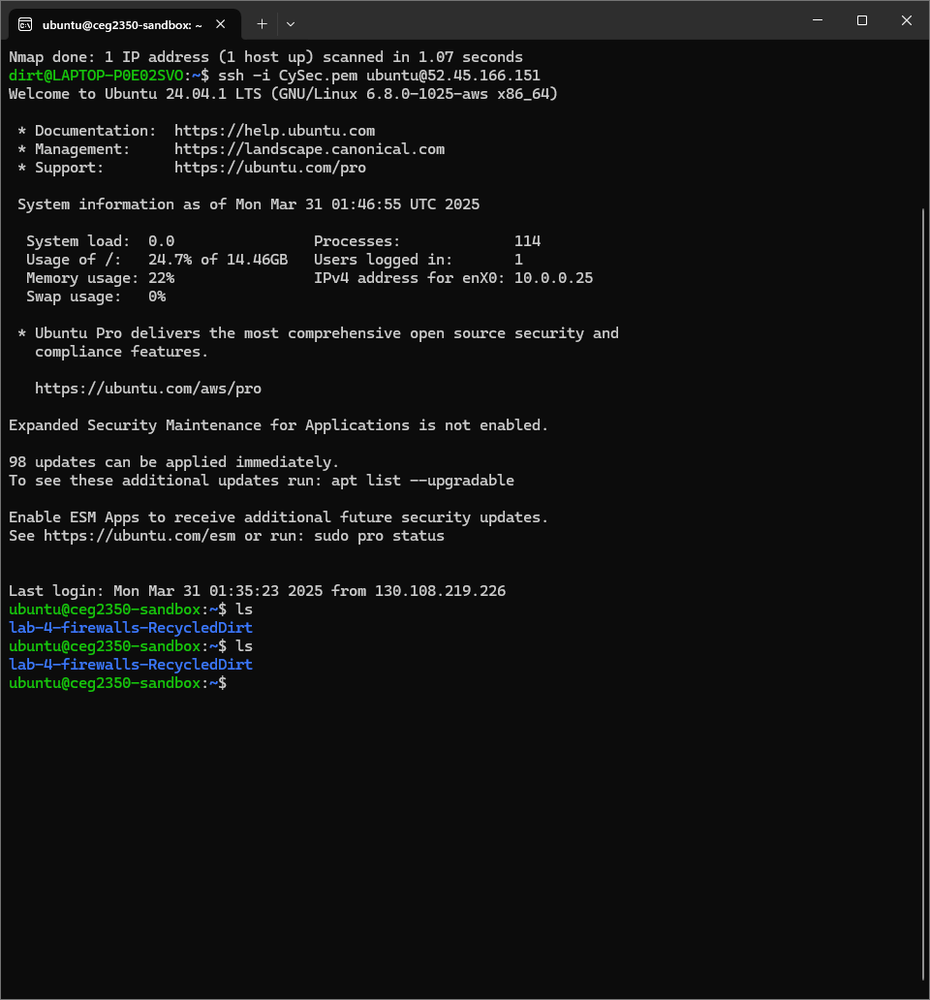
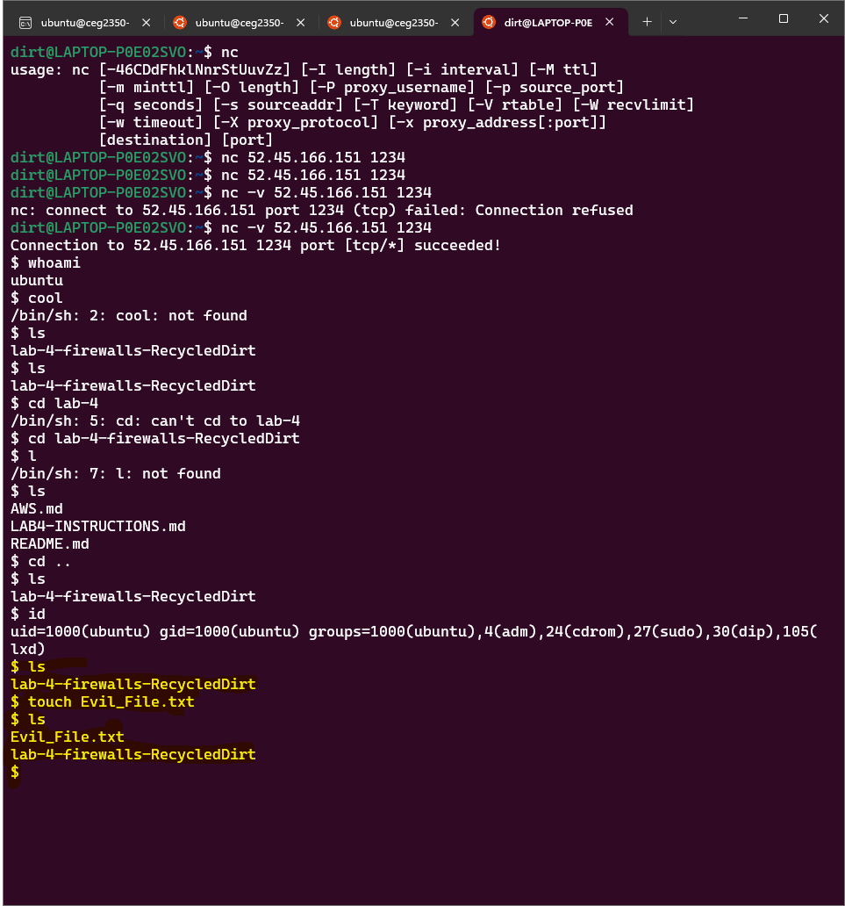
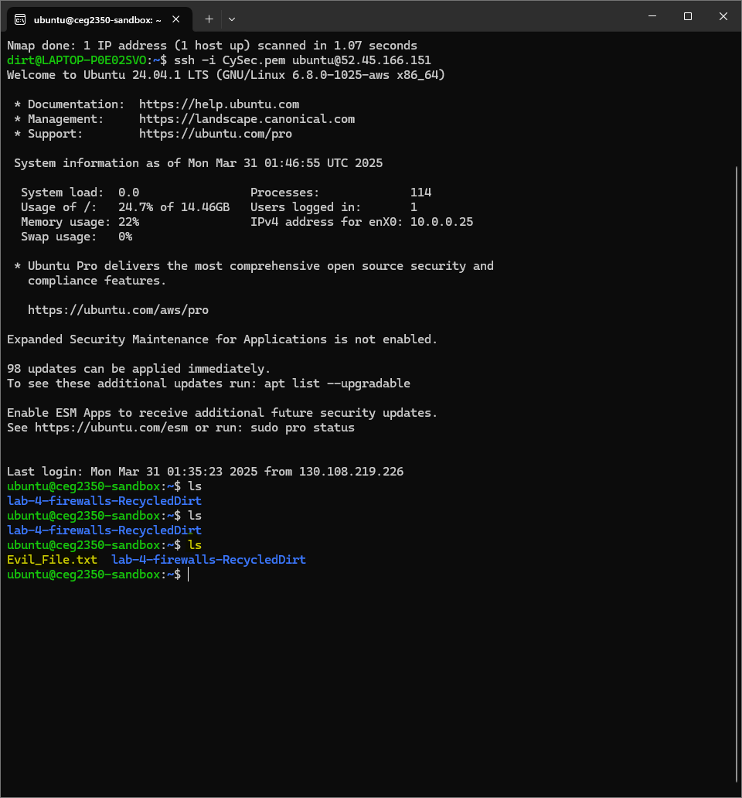
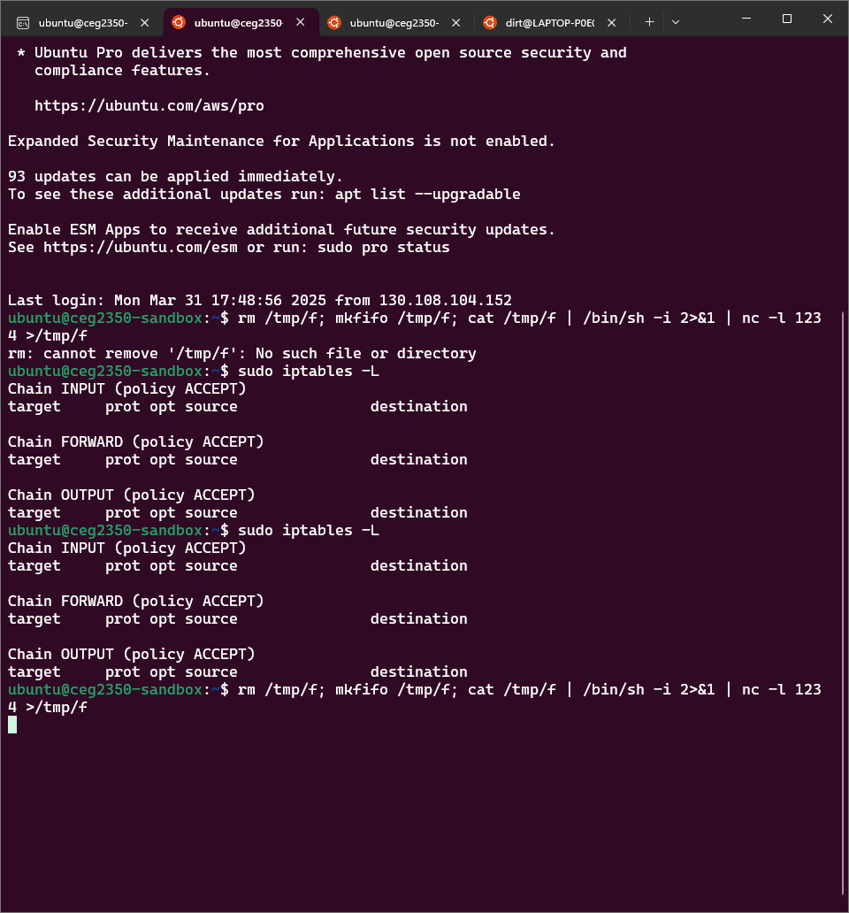
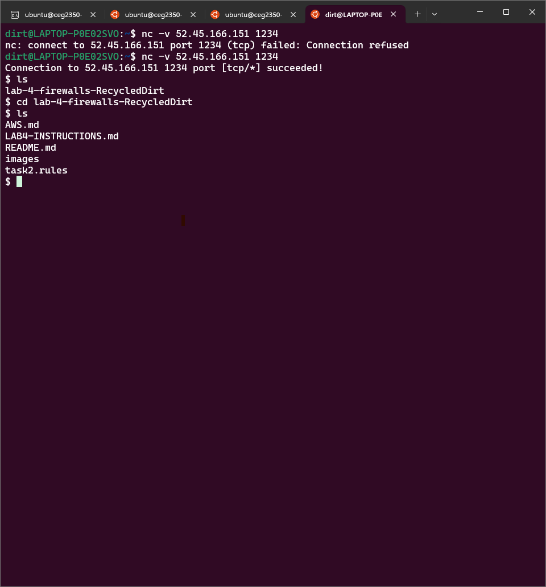
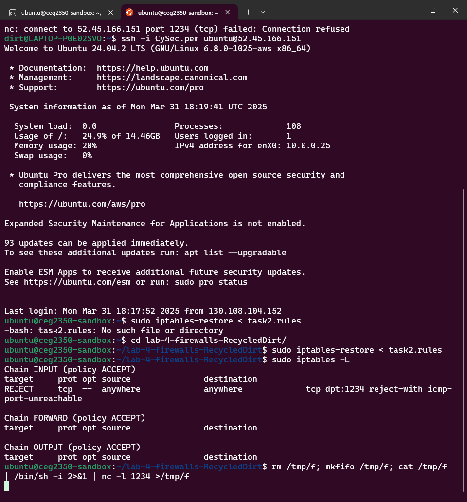
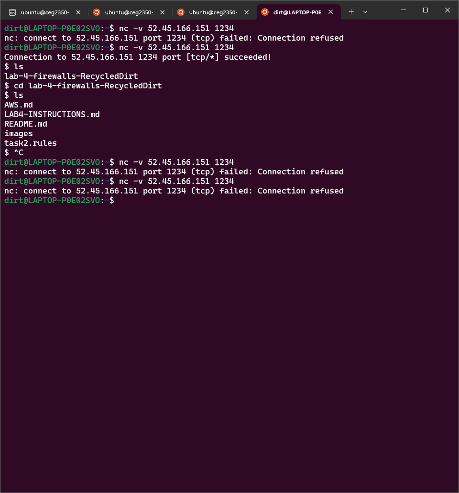
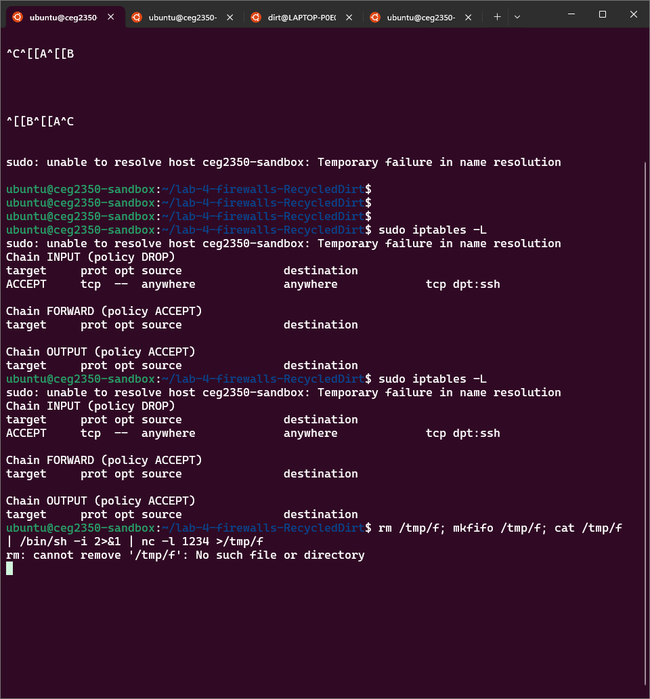
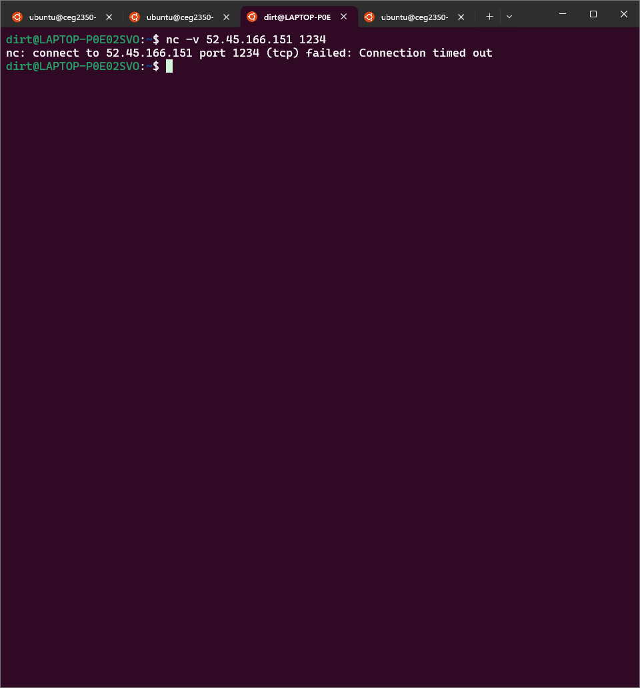
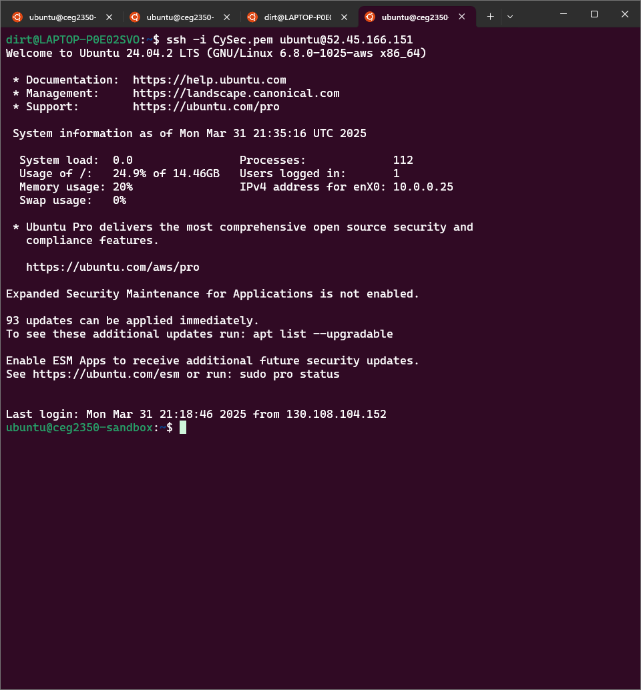

[](https://classroom.github.com/a/5CIshHbq)
# Lab 4 : CEG 3400 Intro to Cyber Security

## Name: Garry Francis

### Task 1: A Shell Game 

Answer the following:

* What port does the provided command open?

The command `rm /tmp/f; mkfifo /tmp/f; cat /tmp/f | /bin/sh -i 2>&1 | nc -l 1234 >/tmp/f` opens port 1234 "hotline"

* What is a Bind Shell and a Reverse Shell (Be verbose and include the links you used in your research!)

Bind Shell:

- Is a configuration that allows remote console connections between computers over a network.

- In this setup, an attacker initiates a service on the target machine, enabling them to connect and control it.

- The attacker can remotely execute commands on the compromised system.

- Before to launching a bind shell, the attacker needs to obtain the victim's IP address so they can connect to the open port.

- The bind shell operates with a listener on the target computer, which the attacker connects to for remote access.

- The attacker identifies an open port on the target machine to bind their shell to that port.

- The listener remains active on the target system, awaiting the attacker’s connection.

- Can fail and encounter issues, as modern firewalls often prevent external connections to open ports.

Reverse Shell:

- Also known as a connect-back, this is a configuration in which the attacker sets up a server on their machine.

- The target machine acts as a client that connects to the attacker's server.

- Once the connection is established, the attacker gains access to the shell of the target computer.

- To initiate a reverse shell, the attacker does not need to know the victim's IP address.

- In this setup, the attacker runs the listener on their own machine, while the target connects to it with a shell.

- The attacker opens a specific port on their machine for the victim to connect, facilitating the connection.

- Since the target connects to the attacker's open port, the attacker does not require knowledge of the victim's IP address.

- A reverse shell operates in contrast to a bind shell, as the listener is active on the attacker's machine, and the target machine initiates the connection.

- Reverse shells can circumvent firewall restrictions, as the target machine initiates the connection to the attacker, making it less likely for firewalls to block the packets.

[Research](https://www.geeksforgeeks.org/difference-between-bind-shell-and-reverse-shell/)

* Which type of shell does this command open?

It opens a bind shell, because it opens up a listening port on my AWS system.

* What/whose permissions does this shell provide?

It gives me the permissions of the `ubnunu` user. Which is basically the permissions to do everything on this system.

* Give evidence of your malicious shell running a command:

```
Screenshots from two terminals
```

The AWS instance ubuntu user's home directory before adding a file


Me on my local system using the Shell connection on port 1234 to add a file


The AWS instance ubuntu user's home directory now with a file added


---

### Task 2: Iptables

**Reminder Deliverable:** Your iptables file created with `iptables-save`

Please name your file `task2.rules`

* Would this iptables firewall configuration (`task2.rules`) be considered a whitelist or blacklist?  Explain.

It would be considered a blacklist because it is specifically blocking the specified port while allowing everything else.

* For the purposes of this class why would you use the `REJECT` action to block this port?

Because the `REJECT` action prevents the packet from using the port and notifies the sender that it was blocked. This way we can see that the iptable file is working for the lab.

* Why might you NOT want to use the `REJECT` action to block this port?

Because the `REJECT` action notifies the sender that it was blocked, which we might not want them to know. So in that case we should use `DROP` action which will deny the packet without notifying the sender.

* How did you verify that this worked?  Be verbose, include more terminal output or screenshots!

To verify that this worked I first connected the shell to AWS without any iptables rules. I was able to connect and do everything the ubuntu user could, as expected. After this I cut the connection and loaded `task2.rules` into iptables. This denied all traffic coming in to port 1234, leaving me unable to connect with the shell from my local system.

The iptables rules before loading in `task2.rules` (empty)


My local system connecting to AWS via the shell


The iptables rules after loading in `task2.rules`


My local system not connecting to AWS via the shell


---

### Task 3: Any Port in a Storm

**Reminder Deliverable:** Your iptables file created with `iptables-save`

Please name your file `task3.rules`

Answer the following:

* Would this iptables firewall configuration (`task3.rules`) be considered a whitelist or blacklist?  Explain.

This would be considered a whitelist because it will block access to every single port accept for what it specifically allows, in this case, port 22 (ssh).

* How did you verify thati his worked?  Be verbose, include more terminal output or screenshots!

Much like the previous rules I first connected to the AWS instance using both SSH and the shell with no iptables rules in effect (not pictured because it is litteraly the same exact thing as the first two pictures in task 2). Both processes worked as expected. Then I turned on the whitelist rule, the shell had its connection denied and I was still able to SSH into the instance.

The iptables rules after loading in `task3.rules`


My local system not connecting to AWS via the shell


My local system connecting to AWS via SSH


* Did you lock yourself out?

No actually, I didn't. Kinda suprising.

---

### Extra Credit

Packet.show()

The scapy output

```python
>>> packet = sniff(filter="port 1234", count=1)[0]
>>> packet.show()
###[ Ethernet ]###
  dst       = 16:ff:c7:32:de:0f
  src       = 16:ff:e0:73:85:47
  type      = IPv4
###[ IP ]###
     version   = 4
     ihl       = 5
     tos       = 0x0
     len       = 55
     id        = 119
     flags     = DF
     frag      = 0
     ttl       = 52
     proto     = tcp
     chksum    = 0xded0
     src       = 130.108.218.244
     dst       = 10.0.0.25
     \options   \
###[ TCP ]###
        sport     = 59744
        dport     = 1234
        seq       = 2495775458
        ack       = 4137870396
        dataofs   = 8
        reserved  = 0
        flags     = PA
        window    = 502
        chksum    = 0x6392
        urgptr    = 0
        options   = [('NOP', None), ('NOP', None), ('Timestamp', (2686989328, 3875379022))]
###[ Raw ]###
           load      = 'ls\n'
``` 

* What scapy sniff options did you use to JUST show needed packets for this task?

I used the `filter` option to limit the sniff to only port 1234 and the `count` command to only show the first packet captured and `[0]` is to select that first (only) packet to be loaded as the value in the `packet` variable.

* Describe the contents of the packet (what command or response did you capture)?

I captured the `ls` command because that is the command that I typed into the shell after setting up the `sniff` in scapy. It came from the wright state network and was sent to port 1234 (as expected), and it was sent over IPv4 (also expected). 
