# Using the AWS VPC and EC2 tools

## Build a VPC

### Create a VPC

A VPC (virtual private cloud) lets you use cloud resources on a cloud network you define using someone elses (Amazons) infrastructure. You can set up every aspect of the network from here and use it however you need.

To make one hit the orange **Create VPC** button near the top of the window and then begin to fill in the information about this new VPC.

1. Resources to create
	
VPC only hit VPC only *DO NOT HIT THE OTHER ONE.*

2. Name tag

Give the VPC its name, resources being used on it should follow a similar naming scheme for simplicity.

3. IPv4 CDIR block

Determines how many IPv4 IPs this network will have. Only set the space for how many IPs your network will need.

4. IPv6 CDIR block

Same as above but for IPv6 IPs.

5. Tenancy

This determines what hardware is being used to run your VPC. *Default Tenancy* will have your VPC on a server shared with other customers. *Dedicated Tenancy* will have your VPC hosted on a dedicated server for you and only you. Default will be cheaper but Dedicated can have better preformance.

6. Tags

Additional labels that can be used to search for your VPC or associate it with other resources. This would be the same for all other enteries so there won't be any more tags sections.

Hit the orange **Create VPC** button at the bottom of the window when completed.

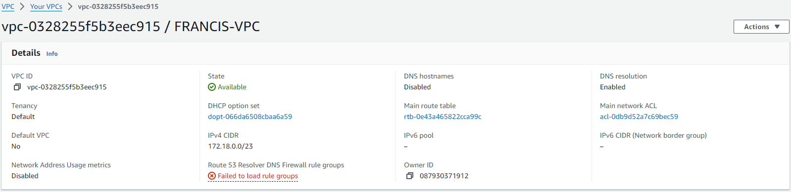

### Create a Subnet

A subnet is a section of the IPs avalable of your VPC that is sectioned off from the rest of the VPC. This is done to keep everyone in their own lane when having multiple people with different jobs working on the same network, or to keep resources only where they are needed.

To make one hit the big orange **Create Subnet** button at the top of the window and fill in the information.

1. VPC ID

This is the VPC that this is going to be a subnet of. Make sure you pick the right one.

2. Subnet name

The name of the subnet, used to find it in a search and identify what its a subnet for.

3. Availability zone

This is the data center that the subnet is being hosted on and where all resources launched in that subnet will be hosted.

4. IPv4 VPC CIDR block

This reminds you of your VPCs block size. You don't give information here.

5. IPv4 subnet CIDR block

This is how many IPs from your VPC you want to be in the subnet.

Hit the orange **Create Subnet** button and then you're golden.

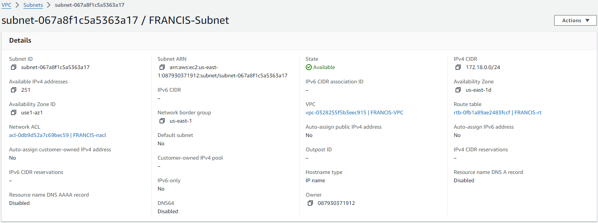

### Create an Internet Gateway

An internet gateway is what gives your VPC access to the internet.

Hit the **Create Internet Gateway** button and fill in the information.

1. Name

The name of the internet gateway, Used to locate in searches.

Hit the **Crate Internet Gateway** button and then we need to attach it to the VPC by selecting the gateway and then hitting *actions,* then *attach to VPC,* and select the VPC you want this to be a gateway for.

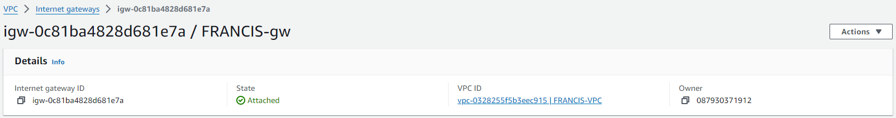

### Create a Route Table

A route table is what controls how the network traffic is directed in the VPC. Each route on the table specifies a destination and a target, allowing control of the traffic.

Hit the **Create Route Table** button and fill the information in

1. Name

The name of the route table. Used to locate and identify what it's for.

2. VPC

The VPC the route table is for.

One **Create Route Table** button later and we have an *empty* route table. Next associate it with your desired subnet by clicking on *subnet associations* and selecting the desired subnet. Next we make a rule that sends traffic to destinations outside of the subnets CIDR block to your internet gateway. Do this by selecting *routes, edit routes, add routes*. Set the destination to be 0.0.0.0/0 and the target to be your internet gateway and hit **Save Changes**.

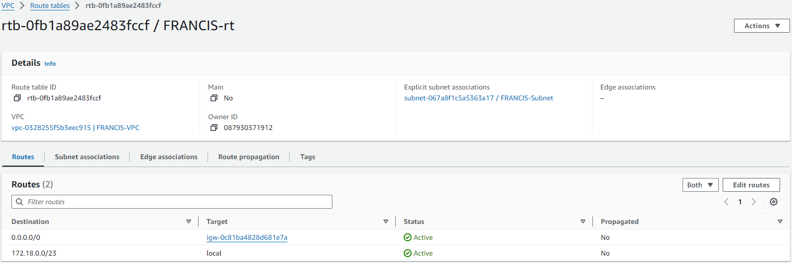

### Create a Security Group

A security group is a list of connections that people are allowed to make on the network. AWS has all connections blocked by default so this way it's YOUR fault if something happenes because you opened things up.

**Create Security Group** button, fill it up.

1. Name

Name of the security group, is *not* made a tag by default so you need to do that manualy.

2. Description

Used to describe the connections allowed or disallowed by the security group.

3. Inboud rules

The rules that decide what can come in. They consist of the type of connection, the protocol, the port it's coming in on, the source of the connection, and a place to give a description about each rule.

4. Outbound rules

The rules that decide what can go out. The setup is identical to inbound rules except instead of the source there is the destination of the connection.

Hit **Create Security Group** and we're done here.

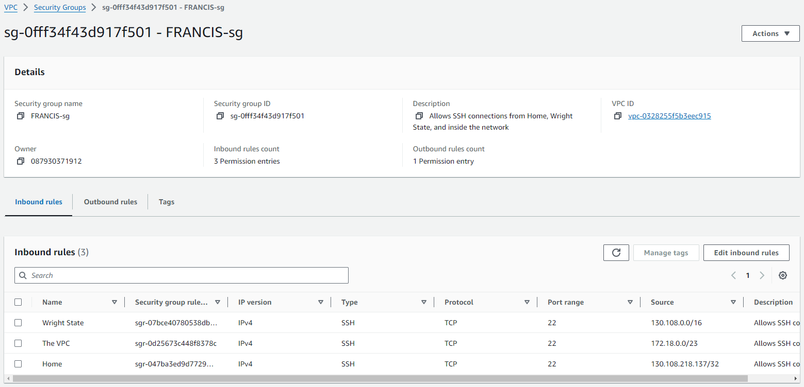

### Modify a Network ACL

A Network ACL is automaticaly created for your subnet. Where the security group is made for the instance level, an ACL operates in the subnet itself, and its rules apply to all instances in the subnet and can be applied to multiple subnets. The ACL can also be used to block specific sources of connection. ACLs are stateless, meaning that you need to set up rules for both incoming and outgoing connections.

So there isn't actualy a need for the **Big Orange Button** this time becaue the ACL is made automatically, so instead find the ACL for the subnet you want to change and select either *Edit Inbound Rules* or *Edit Outbound Rules*

1. Rule number

Rules don't have names, they just have numbers. Still an identifier.

2. Type

The type of connection being made.

3. Protocol

The communication protocol of the connection.

4. Port range

The list of ports being allowed or denied.

5. Source/Destination

The source of a connection coming in or the destination of a connection going out.

6. Allow/Deny

Decides if the rule is there to allow or deny the specified connection.

Hit **Save Changes** and we are good to go.

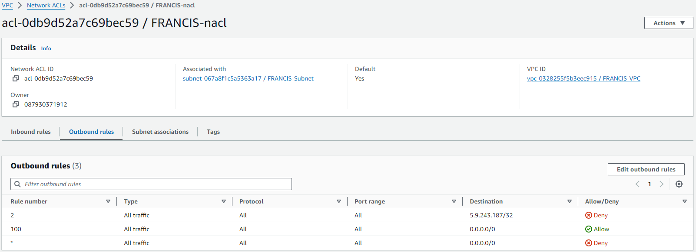

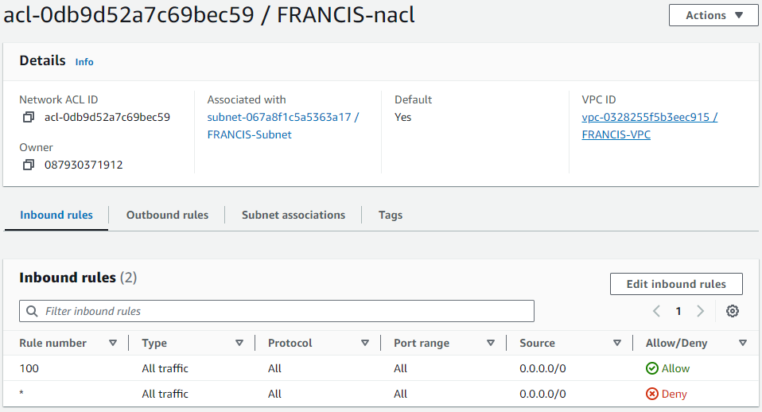

### Create a Key Pair

The key pair is what will let you SSH into your instance like all the other things you used a key for. The key pair creation is located in the EC2 (elastic cloud compute) menu on the AWS dashboard. After entering the key pairs menu hit the **Create Key Pair** button and give the information.

1. Name

Name of the key pair, used to identify but if this changes the key breaks so make sure you name it right.

2. Key pair type

Determines what kind of key pair the keys will be. Most systems/programs/machines/whatever use ED25519 and its the standard of GitHub so you will be selecting that one.

3. Private key file format

Decides the file type of the private key in the key pair. Since we are using OpenSSH in this class select `.pem`.

Once you hit **Create Key Pair** the private key will automatically be downloaded to your system. **YOU CAN NOT GET ANOTHER PRIVATE KEY** so don't lose this one! The public key will be stored on the AWS servers, and can be attatched to multiple instances.

### Reserve an Elastic IP

An elastic IP is an IP that you are able to allocate to your account and can use until you no longer need it. A public IP *AWS version* is an IP address that will be swaped out for another random IP every time your instance turns on.

To get an elastic IP, go to the elastic IP menu and click **Allocate Elastic IP adress** and then just name it. There's nothing else for setup just give it a name tag and then **Create**.

## EC2 Instance Creation

An instance is a virtual server that allows users to run applications in the cloud. Instances can be configured with various operating systems, storage options, and network settings.

To make an instance, go to the instances menu and click the **Launch Instances** button and start to fill in the information.

1. Name

Name of the Instance, used to find it.

Named "FRANCIS-instance".

2. Application and OS images (Amazon Machine Image)

An AMI is a premade template containing the software (OS, application server, applications, etc.) required to run the instance. The available AMIs were developed specificaly to run on AWS systems. Either select a Quick Start AMI (the most used ones) or browse all AMIs to find a specific one. In the description will be the username, which is needed for SSH connections in the future so note it down, along with the AMI ID so you can refer to the correct version of your AMI when its time to codify.

Picked Ubuntu 24.04 LTS.

3. Instance type

This is where you decide the resources from AWS that you are going to be using to run the instance. Options that involve more and better resources will cost more money. Remember to pick resources that are needed for what your trying to do.

Picked t2.micro.

4. Key pair

This is the key pair that will let someone SSH into your instance. If you don't select a key pair it will be *impossible* to get inside the instance. As said before you get the private key and AWS holds the public key. Use the key, instance username, and IP address to get in with `ssh -i [KEY] [USERNAME]@[IP]`.

Using FRANCIS-key.

5. Network settings

This is where you decide what network the instance will be using for its connections. All of these are on their default settings so you will need to select your desired:

- VPC: Francis-VPC
- Subnet: FRANCIS-Subnet
- Auto-assign public IP

**DISABLE THIS!!!** Remember what AWS calls a "public IP" is a constantly reseting IP. Assign your elastic IP later.

- Security Group: FRANCIS-sg
- Advanced details

Do not click this its very scary.

6. Configure storage

How much storage space your instance will be given. You likely won't need more than the default, but you can come back and add more at any time.

Hit **Launch Instance** and then return to the elastic IP menu. There allocate your elastic IP to the instance so it can be used for connections.

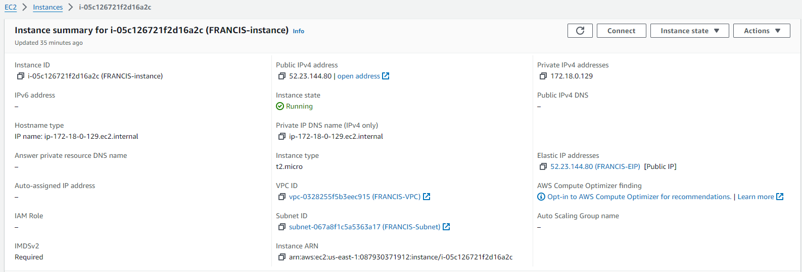

## Instance Configuration

1. SSH into your instance

Use `ssh -i "FRANCIS-key.pem" ubuntu@52.23.144.80`

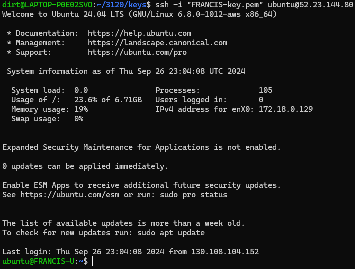

2. Change the hostname

SSH connected to the instance and checked the current hostname with `hostname`. The hostname is currently 'ip-172-18-0-129'. I made a copy of the hostname file in /etc using `sudo cp hostname hostname.old`. Then I ran the command `sudo hostnamectl set-hostname FRANCIS-U`. this changed the contents of the hostname file to `FRANCIS-U`. after restarting the instance the hostname is still FRANCIS-U.

3. Create a screenshot of SSH connection with changed Hostname

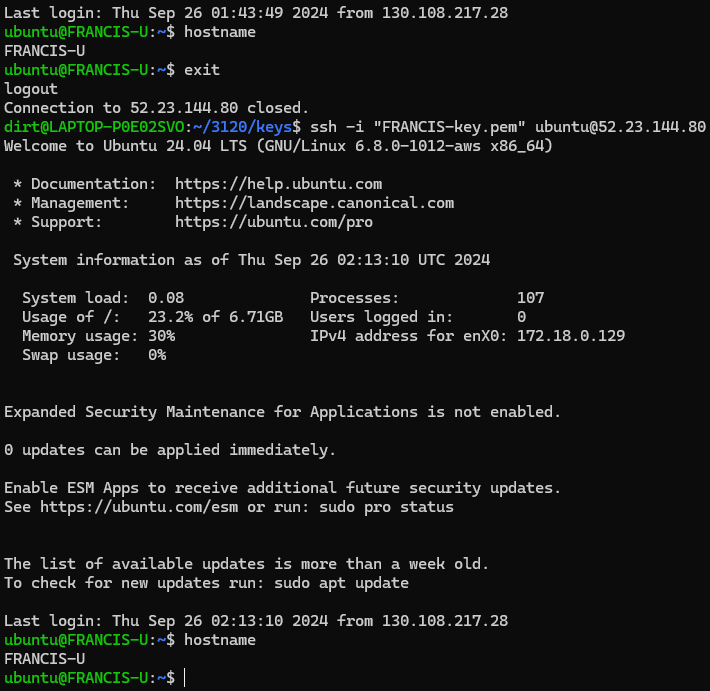

4. Prove the NACL and SG are working properly

wttr.in cannot be connected to while ipinfo can still be connected to

Connection from WSUsecure works

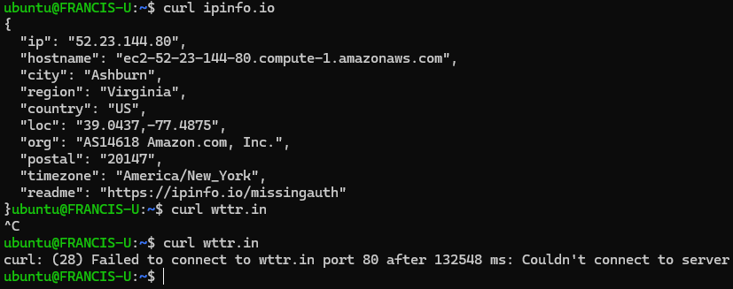