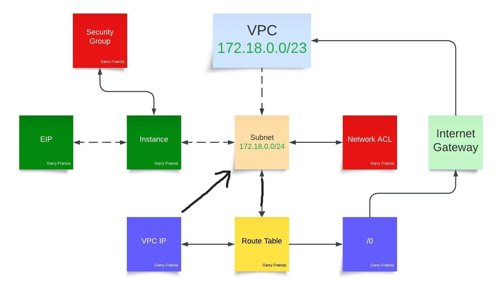

# Project 2

## Project description

### Template format version

This will be the first line in every CFTemplate. It identifies what the template is capable of creating. The current most up to date and only valid version of this is `AWSTemplateFormatVersion: 2010-09-09`.

### Description

This is just a description of what the template does/is for. This is only here for documentation and is not needed for a working template. Use `>-` to give yourself more room to type something out.

```yml
Description: <place where you describe>
```

## Paramaters

Paramaters are an optional section of customizations for templates. These allow you to input custom values into your template before it is created, allowing the created stacks to be more customizeable.

### KeyName

This asks the user to input an existing EC2 key pair to use with the template. This is probably a good thing to have at all times because having a predetermined key for a template is just... not a good idea.

```yml
KeyName:
  Description: <place where you describe>
  Type: 'AWS::EC2::KeyPair::KeyName'
  ConstraintDescription: <place where you write error message>
```

### SSHLocation

This asks the user for a CDIR block that can be used as a variable in the template. This is useful for when you are not in the same place as whoever made the template but for our purposes its useless.

```yml
SSHLocation:
    Description: <place where you describe>
    Type: String
    MinLength: '9'
    MaxLength: '18'
    Default: 0.0.0.0/0
    AllowedPattern: '(\d{1,3})\.(\d{1,3})\.(\d{1,3})\.(\d{1,3})/(\d{1,2})'
    ConstraintDescription: <place where you write error message>
```

## Mappings

This lets you create keys for certain values. You can set this up so that your template can do different things depending on the Instance type or the AWS region.

```yml
Mappings:
  AWSInstanceType2Arch:  # Supported architectures (x64bit only)
    t2.micro:
      Arch: HVM64
  AWSRegionUbuntu: # AMI for Ubuntu server in each supported region
    us-east-1:   # N. Virginia
      PV64: NOT_SUPPORTED
      HVM64: <where you put your machine image>
      HVMG2: NOT_SUPPORTED
```

If you want to have multiple options, do this

```yml
Mappings: 
  RegionMap: 
    us-east-1: 
      "HVM64": ...
    us-west-1: 
      "HVM64": ...
    eu-west-1: 
      "HVM64": ...
    ap-southeast-1: 
      "HVM64": ...
    ap-northeast-1: 
      "HVM64": ...
```

And this to find it later.

```yml
Resources: 
  myEC2Instance: 
    Type: "AWS::EC2::Instance"
    Properties: 
      ImageId: !FindInMap [RegionMap, !Ref "AWS::Region", HVM64]
      InstanceType: m1.small
```

## Resources

This is where you set instructions for creating the acutal stack. You should remember what these do. Making a resource follows a set pattern that being

1. Logical ID: An unique alphanumeric name that will be used to reference the resource in the template.

2. Resource type: The kind of resource you are making, be it VPC subnet or security group.

3. Resource properties: Options for customisation of the resource. You can also add tags under properties. This is very helpful for tracking stack resources.

```yml
Resources:
  Logical ID:
    Type: Resource type
    Properties:
      Set of properties
```

### VPC

This is instructions for creating the VPC. It will require you to specify that it is a VPC as its resource type and a CDIR block that it will take up.

```yml
VPC:
    Type: 'AWS::EC2::VPC'
    Properties:
      CidrBlock: 172.18.0.0/23 # Requested VPC block
      Tags:
        - Key: Application
          Value: !Ref 'AWS::StackId'
        - Key: Name
          Value: FRANCIS-CF-VPC # name of vpc
```

### Subnet

Instructions for creating the subnet. Requirements are the Logical ID of the vpc for attatchment, a CIDR block inside of the VPC, and the specification that it is a subnet.

```yml
Subnet:
    Type: 'AWS::EC2::Subnet'
    Properties:
      VpcId: !Ref VPC
      CidrBlock: 172.18.0.0/24 # Requested subnet block
      Tags:
        - Key: Application
          Value: !Ref 'AWS::StackId'
        - Key: Name
          Value : FRANCIS-CF-SUBNET # name of subnet
```

### Internet Gateway

Instructions for creating the internet gateway. Requirements are that it is specified to be one.

```yml
InternetGateway:
    Type: 'AWS::EC2::InternetGateway'
    Properties:
      Tags:
        - Key: Application
          Value: !Ref 'AWS::StackId'
        - Key: Name
          Value: FRANCIS-CF-IG # name of internet gateway
```

Attaching the gateway to your VPC is done seperately. This action requires being specified as a gateway attachment, the ID of the VPC, and the ID of the gateway.

```yml
AttachGateway:
    Type: 'AWS::EC2::VPCGatewayAttachment'
    Properties:
      VpcId: !Ref VPC
      InternetGatewayId: !Ref InternetGateway
```

### Route Table

Creates a route table. Requires specification that it is a route table and the VPC ID to attach to.

```yml
RouteTable:
    Type: 'AWS::EC2::RouteTable'
    Properties:
      VpcId: !Ref VPC
      Tags:
        - Key: Application
          Value: !Ref 'AWS::StackId'
        - Key: Name
          Value: FRANCIS-CF-RT # name of route table
```

Then you need to make a route for it to send external traffic to the internet gateway. Making a route requires the IDs of the route table and gateway, along with the destination CIDR block. You can also add a `DependsOn` option, that will make it wait for the gateway.

```yml
Route:
    Type: 'AWS::EC2::Route'
    DependsOn: AttachGateway
    Properties:
      RouteTableId: !Ref RouteTable
      DestinationCidrBlock: 0.0.0.0/0
      GatewayId: !Ref InternetGateway
```

You also still need to associate the table with your subnet using the IDs of the table and subnet, and specification that this is a subnet route table association.

```yml
SubnetRouteTableAssociation:
    Type: 'AWS::EC2::SubnetRouteTableAssociation'
    Properties:
      SubnetId: !Ref Subnet
      RouteTableId: !Ref RouteTable
```

### Elastic IP

Reserves an Elastic IP for the instance that you havent made the code for yet so you should probably use `DependsOn` so it waits for that. Requirements are specification that its an EIP, its domain (what its used for (A VPC)) and the ID of the instance

```yml
UbuntuIPAddress:
    Type: 'AWS::EC2::EIP'
    DependsOn: AttachGateway
    Properties:
      Domain: vpc
      InstanceId: !Ref PublicUbuntuInstance
```

### Security Group

Creates the security group and its rules, Ingress means an inbound roule and are marked with `SecurityGroupIngress`. Egress means an outbound rule and are marked with `SecurityGroupEgress`. Remember that outbound traffic is not restricted by default. Requirements are the security group type and the ID of the vpc youre attaching it to.

```yml
SecurityGroup:
    Type: 'AWS::EC2::SecurityGroup'
    Properties:
      VpcId: !Ref VPC
      Tags:
        - Key: Application
          Value: !Ref 'AWS::StackId'
        - Key: Name
          Value: FRANCIS-CF-SG # name of security group
      GroupDescription: Enable SSH access via port 22 and open all internal ports to HTTP.
      SecurityGroupIngress:
        - IpProtocol: tcp
          FromPort: '22'
          ToPort: '22'
          CidrIp: 130.108.219.170/32 # My IP (SSH)
        - IpProtocol: tcp
          FromPort: '22'
          ToPort: '22'
          CidrIp: 172.18.0.0/24 # The Subnet (SSH)
        - IpProtocol: tcp
          FromPort: '22'
          ToPort: '22'
          CidrIp: 130.108.0.0/16  # WSU CIDR (SSH)
        - IpProtocol: tcp
          FromPort: '80'
          ToPort: '80'
          CidrIp: 0.0.0.0/0 # Any IP (HTTP)
```

### Network ACL

Instructions to create the network acl. Requires the NACL type and the VPC ID.

```yml
NetworkACL:
    Type: 'AWS::EC2::NetworkAcl'
    Properties:
      VpcId: !Ref VPC
      Tags:
        - Key: Name
          Value: FRANCIS-CF-NACL # name of networkACL
        - Key: Application
          Value: !Ref 'AWS::StackId'
```

The rules are made seperately. An allow rule and a deny rule have mostly the same construction except for the property `RuleAction` where it can be set to either allow or deny. All rules require the NACL entry tag and the ID of the NACL they are rules for.

Allow rule:

```yml
OutboundAllowAllRule:
    Type: AWS::EC2::NetworkAclEntry
    Properties:
      NetworkAclId: !Ref NetworkACL
      RuleNumber: 100
      Protocol: -1
      Egress: true
      RuleAction: allow
      CidrBlock: 0.0.0.0/0
```

Deny rule:

```yml
OutboundDenyWttrRule: # Deny outboud traffic to Wttr.in
    Type: AWS::EC2::NetworkAclEntry
    Properties:
      NetworkAclId: !Ref NetworkACL
      RuleNumber: 1
      Protocol: -1
      Egress: true
      RuleAction: deny
      CidrBlock: 5.9.243.187/32
```

To associate the NACL with your subnet, you need to set type to subnet NACL association, and the IDs of the subnet and NACL.

```yml
SubnetNetworkAclAssociation:
    Type: AWS::EC2::SubnetNetworkAclAssociation
    Properties:
      SubnetId:
        Ref: Subnet
      NetworkAclId:
        Ref: NetworkACL
```

### Instance

Creates an instance. This uses the settings from mapping to determine what kind of Instance type and AMI to use in creation. Needs instance type specification, the actual instance type, the KeyName from paramaters (or no key if you just like useless systems), and the AMI.

```yml
PublicUbuntuInstance:
    Type: 'AWS::EC2::Instance'
    DependsOn: AttachGateway
    Properties:
      ImageId: !FindInMap [AWSRegionAMI, !Ref "AWS::Region", HVM64]
      InstanceType: t2.micro
      KeyName: !Ref KeyName
      Tags:
        - Key: Application
          Value: !Ref 'AWS::StackId'
        - Key: Name
          Value: FRANCIS-CF-Ubuntu # name of instance
```

To give the instance a private IP in the subnet and associate the security group. Needs the IDs of the group and subnet and a private IP within the subnet.

```yml
NetworkInterfaces:
        - GroupSet:
            - !Ref SecurityGroup
          AssociatePublicIpAddress: 'true'
          DeviceIndex: '0'
          DeleteOnTermination: 'true'
          SubnetId: !Ref Subnet
          PrivateIpAddress: 172.18.0.10
```

## UserData

This is a place where you can set up commands to be run on the creation of the instance. This can be used to set up specific things for the instance, install software, or run scripts on startup. the `\` means to go to the next line. the `&&` means to do the next command after this one is done. so `&& \` means to do the command on the next line.

```yml
UserData:
        Fn::Base64: # All starting commands are implemented
          !Sub |
            #!/bin/bash -xe
            apt-get update && \
            apt-get install -y \
              git \
              htop \
              sl \
              python3 \
              python3-pip \
              apache2 \
              curl \
              wamerican && \
            hostnamectl set-hostname FRANCIS-TEST-CF && \
            echo "This is from the CF template" > /home/ubuntu/hello.txt && \
            curl -L -o /home/ubuntu/wordle.sh https://raw.githubusercontent.com/pattonsgirl/CEG3120/main/Projects/Project2/wordle.sh && \
            sudo chmod +x wordle.sh && \
            curl -L -o /var/www/html/index.html https://raw.githubusercontent.com/pattonsgirl/CEG3120/main/Projects/Project2/index.html && \
            reboot
```

# Diagram



## Diagram notes

So the VPC is connected to the subnet with a dashed line because thats how I decided to denote things being "inside" one another. The subnet is connected to the network ACL with a solid line because they are not contained in eachother. The connections reason to exist at all is that the NACL works directly on the subnet so they have that direct association to eachother. The subnet is connected to the route table becuase the route table handles information traveling through the subnet. there are two paths out of the route table, one for internal communications that will return to the subnet (as shown by the arrow that was totaly there when I made this in lucid charts), and one for external communicatons that goes to the internet gateway. The internet gateway then sends that information out to the internet. It can also get information from the internet which gets sent back into the VPC propper. The subnet is also connected to the instance because the instance is a specific private IP on the subnet. The instance is connected to the elastic ip because the eip is its public ip used for ssh connections. The instance is also connected to the security group because security groups work at the instance level unlike NACLs.