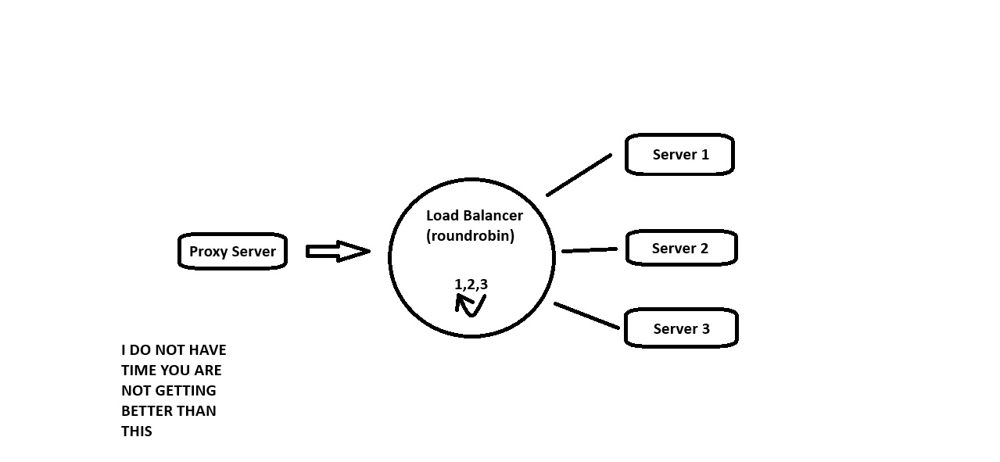
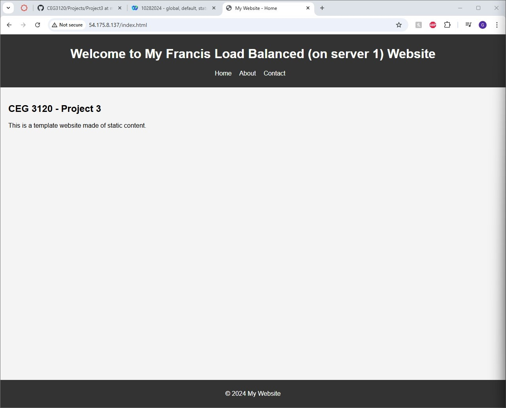
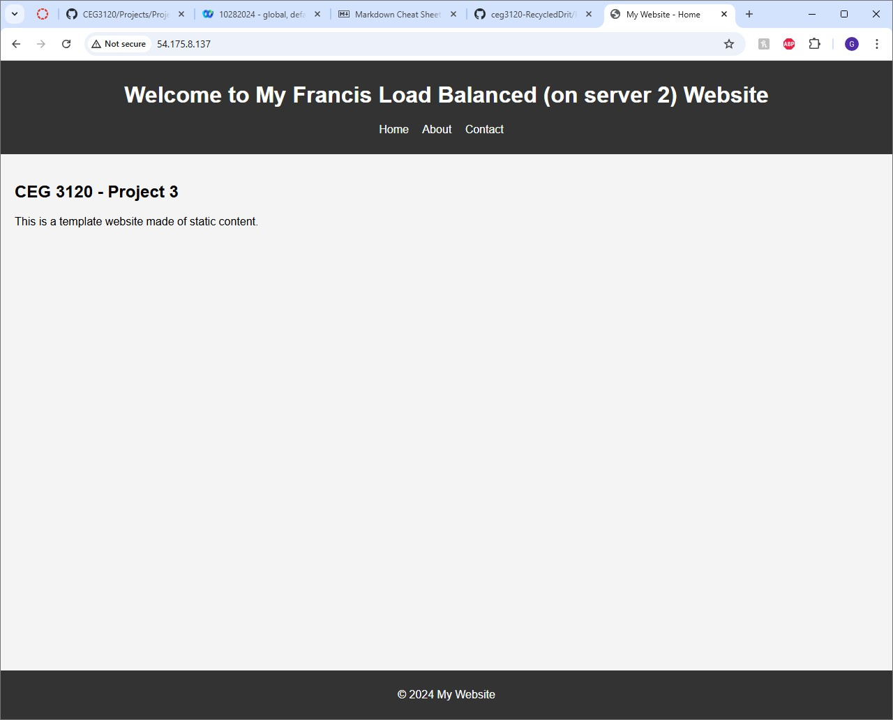
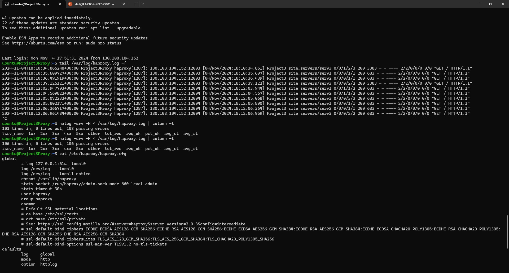

# Project 3

## Project Description

This project will to show you how to host a website using apache2 and how to configure a load balancer using HAProxy. You should remember from last time (Project 2) how to use a CF template because we're doing that again this time around. Our template is going to make a VPC that contains: 

- Two subnets, one public and one private 
- An internet gateway
- A public route table that connects the public subnet to the internet gateway 
- A NAT gateway for the private and public subnets 
- A private route table that connects the private subnet and the NAT gateway
- A security group with five rules allowing SSH and HTTP connections from trusted sources.
- A proxy instance that takes traffic and redirects it to the private instances
- Three private instances for hosting web content



The load balancer takes in traffic from the proxy server, and then allocates the traffic to its connected servers in accordance with the load balancing algorithim. Roundrobin, for example, cycles through the avalable servers in order before returning to the start.

## SSH Settings

In my own computer instance's `.ssh/config` file I set up the following entry:

```
Host proxy
    HostName 3.227.159.171
    User ubuntu
    port 22
    IdentityFile /home/dirt/3120/keys/FRANCIS-key.pem
```

This lets me connect into the proxy instance, which in that instance's `.ssh/config` file I enter:

```
Host serv1
    HostName 172.18.1.10
    User ubuntu
    Port 22
    IdentityFile /home/ubuntu/FRANCIS-key.pem

Host serv2
    HostName 172.18.1.25
    User ubuntu
    Port 22
    IdentityFile /home/ubuntu/FRANCIS-key.pem

Host serv3
    HostName 172.18.1.50
    User ubuntu
    Port 22
    IdentityFile /home/ubuntu/FRANCIS-key.pem
```

In each of the server instances, I set up identical `.ssh/config` files but without the command for the server they are on.

Used `sftp` to transfer `FRANCIS-key.pem` to the respective locations

## HAProxy

HAProxy is a program that is used to create proxies, something that lets traffic appear to be comming from a different IP than it actualy is. We will be using a reverse proxy, or a load balancer, to allow http connections into the proxy instance to access the website content located on the private instances, and control the amount of traffic each server is getting.


Inside of the proxy instance go to the HAProxy config file at `etc/haproxy/haproxy.cfg`. This file is where you set up how the proxy system preforms. The cfg file is split into four config blocks:

1. Global

Global settings are for security and preformance accross HAProxy

- maxconn: Limits the number of connections that HAProxy will accept. Useful for keeping your LB from running out of memory. `maxconn [number]`
- log: Makes sure that issues and requests are recorded to syslog. You can change where the logs are stored, but it is usualy in `local0`. `log /dev/log local0`
- user/group: Tells HAProxy to drop its root privliges after initialization. `user haproxy` or `group haproxy`
- stats socket: Enables runtime API, which can disable servers and health checks, change the LB on servers, basicaly starts automation. `stats socket /run/haproxy/admin.sock user haproxy group haproxy mode 660 level admin`

2. Defaults

Settings in defaults apply to all frontend and backend sections that come after it. New default sections overwrite the rules of previous ones.

- timeout connect/client/server: Client sets the time (in miliseconds unless specified) that HAProxy will wait for a connection to be established before declairing a timeout. Client measures inactivity during periods that the client is expected to be sending TCP segments before timing out. Server measures time waiting for the server to respond before timeout. `timeout [TYPE] [TIME]`
- log global: tells following frontends to use the log setting defined in global. `log global`
- mode: defines whether HAProxy is only acting as a TCP proxy or is inspecting higher level HTTP. `mode [TYPE]`
- maxconn: Same thing but restricts frontend connections.

3. Frontend

Frontend defines the IP addresses and ports that users can connect to. You can have as many frontends as needed.

- bind: Gives access to specifc IP and port. use `ssl` and `crt` to manage SSL/TLS terminations. `bind *:[PORT]` (star means any ip)
- http-request redirect: Tells client to try a different url. `http-request redirect scheme https unless { ssl_fc }`
- use backend: Chooses a specific backend to send traffic that meets specified criteria to. `use_backend api_servers if { path_beg /api/ }`
- default backend: The backend traffic will be sent to if not picked up by a use backend command. `default_backend web_servers`

4. Backend

Backend defines the servers that will be loadbalanced by HAProxy and how the balancing will happen

- balance: Controls how the load balancing happens, common settings are `roundrobin`, which cycles through avalable servers in order, and `leastconn` which chooses the server with the least active connections. `balance [SETTING]`
- cookie: Enables a type of cookie, what kind is in the settings. `cookie [NAME] [SETTINGS]`
- option httpchk: causes HAProxy to send HTTP health checks to servers instead of TCP checks. Servers that don't respond are not sent any more requests. `option httpchk HEAD /`
- default-server: Like the defaults section but specificaly for servers. Gives settings that apply to all following servers. `default-server [SETTINGS]`
- server: Defines a server that can have traffic sent to it using IP address and port. also decides if cookies are enabled. `server [NAME] [IP+PORT] [SETTINGS]`

Once you have set everything up, restart HAProxy using the command `sudo systemctl restart haproxy` to ensure that the changes take effect.

[HAProxy website](https://www.haproxy.com/blog/the-four-essential-sections-of-an-haproxy-configuration)

## Host Instance Setup

### Changing simple-site

To change where it says "YOURLASTNAMEHERE" on the simple-site, you will have to edit the HTML of its files. The CF template has already sent the files to the default directory for apache2 website content, that being `/var/www/html/`. So to edit the files we need to go to that directory and `vim` each html file in the `simple-site` directory. Then find the place where it says "YOURLASTNAMEHERE" and replace it with... okay you can figure this one out.

### Config Changes

If you try to view your website now, you will only see the apache2 default page. This is because you haven't changed the page being displayed by apache2 to your website yet. To do this, go to the `/etc/apache2/sites-available/000-default.conf` file and change the line that says `DocumentRoot /var/www/html` to `DocumentRoot /var/www/html/simple-site`.

Finally, run the command `sudo systemctl restart apache2` to restart the service and make sure all changes have been implemented correctly.

## Proof this works

Okay so did any of this actually do anything? Well to check just try connecting to the proxy with HTTP. type http://3.227.159.171/ into your search engine and BEHOLD, its there. Notice the numbers in parts of each page showing what private instance it is currently being hosted on, and that this number changes in a cycle of 1,2,3. This shows that the roundrobin LB is working.

Picture of the Home screen hosted on server 1:



Picture of the Home screen hosted on server 2:



Picture of the Home screen hosted on server 3:


And if that doesnt convince you, lets look at the HAProxy logs about the server activity. Typing the command `tail /var/log/haproxy.log -f` will give you the activity of the logs for HAProxy

Picture of log command output:



And there you've done it.